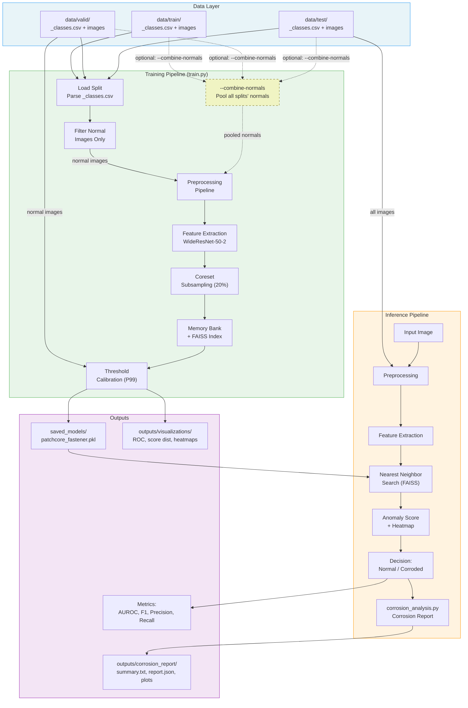
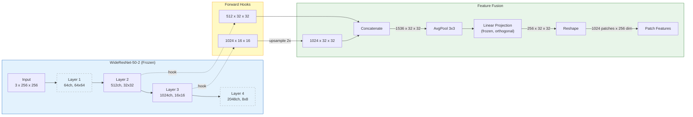
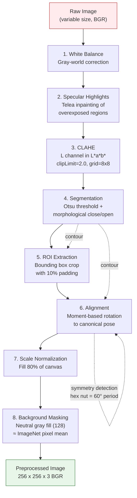
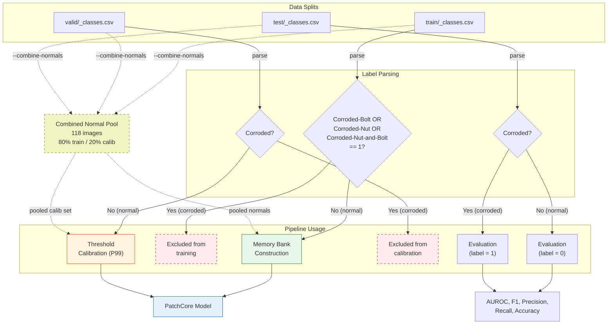
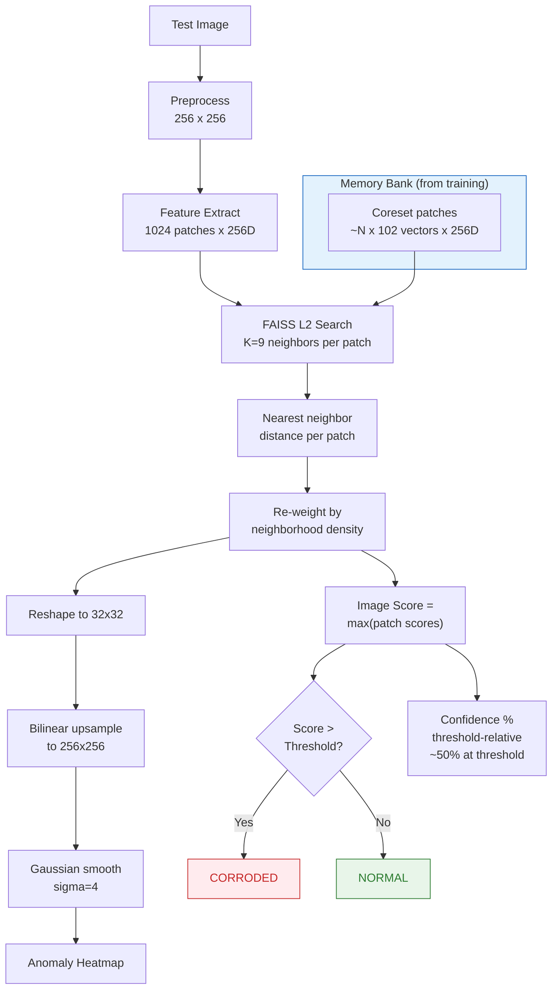
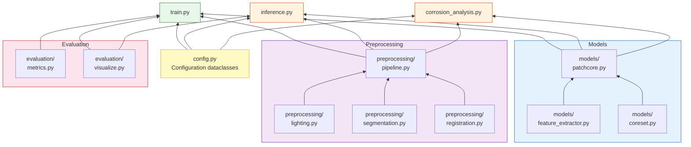

# Architecture Diagrams

Mermaid diagrams for the fastener corrosion detection pipeline. Render these in any Mermaid-compatible viewer (VS Code Markdown Preview, GitHub, mermaid.live, etc.).

---

## 1. High-Level System Architecture

---

## 2. PatchCore Model Architecture

---

## 3. Preprocessing Pipeline

---

## 4. Training Data Flow

---

## 5. Anomaly Scoring at Inference

---

## 6. Module Dependency Graph

